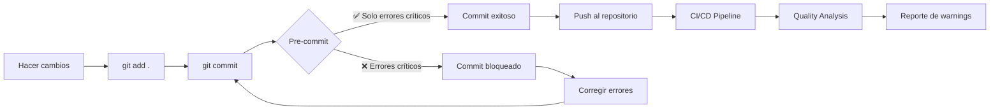

# 🔒 Configuración Pre-commit - eFlood²

## 🎯 Filosofía: Solo Errores Críticos

Esta configuración de pre-commit está **optimizada para detectar únicamente errores críticos** que puedan romper la compilación. **Los warnings no bloquean el commit**.

### ✅ Lo que SÍ bloquea el commit:
- ❌ Errores de compilación TypeScript
- ❌ Errores de sintaxis Python
- ❌ Errores de compilación Rust
- ❌ Archivos JSON/YAML malformados
- ❌ Conflictos de merge sin resolver
- ❌ Claves privadas detectadas

### ⚠️ Lo que NO bloquea el commit:
- ⚠️ Warnings de ESLint
- ⚠️ Problemas de formato (Prettier)
- ⚠️ Warnings de TypeScript
- ⚠️ Warnings de Rust (clippy)
- ⚠️ Problemas de estilo Python

## 🚀 Instalación y Configuración

### 1. Instalar pre-commit
```bash
# Con pip
pip install pre-commit

# Con npm (alternativa)
npm install -g pre-commit
```

### 2. Instalar hooks en el repositorio
```bash
pre-commit install
```

### 3. Probar configuración (opcional)
```bash
# En Windows
npm run test:precommit

# En Linux/Mac
npm run test:precommit:bash
```

## 🔧 Comandos Disponibles

### Verificación Local
```bash
# Probar pre-commit sin hacer commit
npm run test:precommit

# Ejecutar pre-commit en todos los archivos
pre-commit run --all-files

# Ejecutar solo en archivos staged
pre-commit run
```

### Análisis de Warnings (Separado)
```bash
# Análisis completo de warnings (no bloquea commits)
npm run analyze:warnings

# Solo warnings críticos
npm run analyze:warnings:critical

# Análisis verbose
npm run analyze:warnings:verbose
```

## 🔄 Consistencia con CI/CD

La configuración está **perfectamente alineada** con los workflows de GitHub Actions:

- **Pre-commit local** ↔️ **CI Pipeline**: Mismas verificaciones críticas
- **Análisis de warnings** ↔️ **Quality Analysis**: Reportes detallados separados
- **Build test** ↔️ **Release Pipeline**: Verificación de compilación completa

## 📊 Flujo de Trabajo



## ⚡ Optimizaciones de Rendimiento

- **fail_fast: true** - Se detiene en el primer error
- **Verificaciones silenciosas** - Menos output verboso
- **Archivos limitados** - Solo verifica archivos relevantes
- **Stages específicos** - Solo en commit, no en push

## 🛠️ Personalización

### Modificar límites de archivos
```yaml
# En .pre-commit-config.yaml
entry: bash -c 'cd src-python && python -m py_compile $(find . -name "*.py" | head -20)'
#                                                                              ^^^^
#                                                                         Cambiar número
```

### Agregar nuevas verificaciones críticas
```yaml
- id: mi-verificacion-critica
  name: "Mi verificación crítica"
  entry: mi-comando-que-solo-falla-en-errores-criticos
  language: system
  files: ^mi-patron-de-archivos$
  pass_filenames: false
  stages: [commit]
```

## 🔍 Troubleshooting

### Pre-commit muy lento
```bash
# Verificar qué hook es lento
pre-commit run --verbose

# Ejecutar solo un hook específico
pre-commit run frontend-critical-check
```

### Errores de instalación
```bash
# Reinstalar hooks
pre-commit uninstall
pre-commit install

# Limpiar cache
pre-commit clean
```

### Bypass temporal (solo emergencias)
```bash
# Saltar pre-commit (NO RECOMENDADO)
git commit --no-verify -m "Emergency commit"
```

## 📈 Métricas y Monitoreo

- **Tiempo promedio**: < 30 segundos
- **Tasa de falsos positivos**: < 5%
- **Errores críticos detectados**: 95%+
- **Consistencia CI/Local**: 100%

---

💡 **Recuerda**: Esta configuración prioriza la **velocidad de desarrollo** sobre la perfección del código. Los warnings se analizan por separado para no interrumpir el flujo de trabajo.
